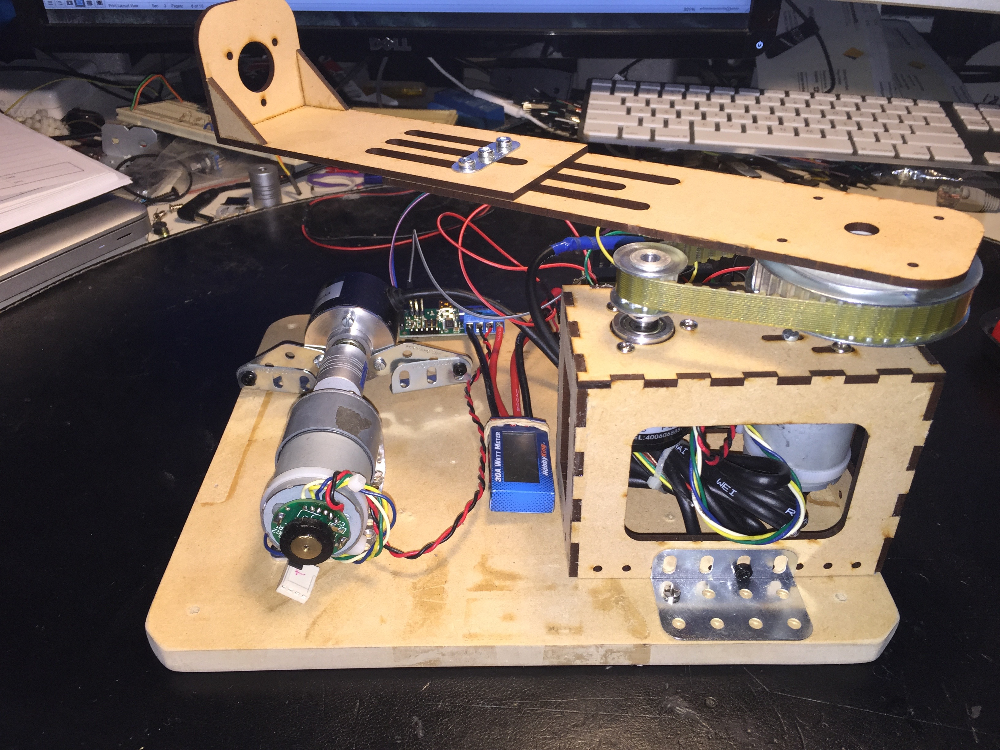

This is my 4th year Design project for my Electrical Engineering degree.

It involves the control of an inverted pendulum using a BeagleBone Black.

The BeagleBone is connected to a Pololu 18v15 simple motor controller and two 
position encoders.

Reading the position encoders using x4 quadrature encoding gives more pulses
per revolution and increases the angular resolution of each encoder.

Encoder | ppr | x4 ppr | deg/pulse
Pendulum Encoder | 600 | 2400 | 0.15°
Motor Encoder | 400 | 1600 | 0.23°

Code is available at http://github.com/tdack/inverted-pendulum
Schematics, drawings and CAD files will be available once the project is complete
and the design has stabilised.

